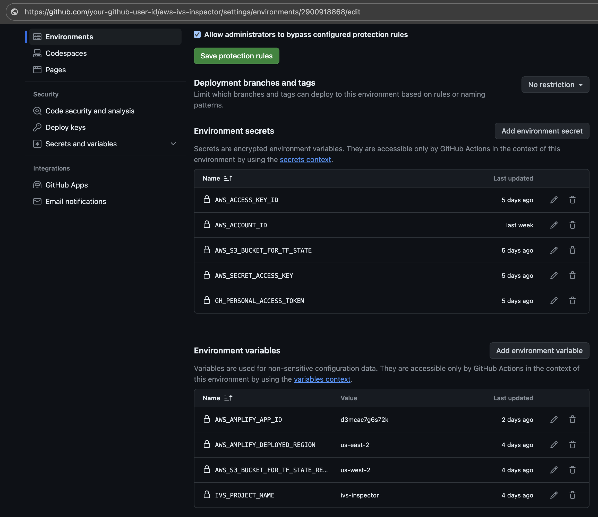
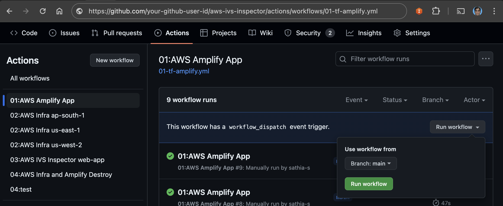

# NOTE—Creating this infrastructure may incur costs. Please refer to the AWS pricing for more information.

:TODO: Provide an overview of the benefits of this project.

## Installation

#### Please note that since various services are being deployed, the AdministratorAccess would make it easy. However, we recommend deleting or disabling the user or removing the policy from the user upon deployment completion. You would only require access for deployment.

:TODO: AdministratorAccess policy is to be refined.

1.) AWS Account & Permissions: You'll need an AWS account and the IAM user permissions with the `AdministratorAccess` policy required

2.) Create an S3 bucket in your AWS account to store the Terraform-generated state file and add the bucket name in GitHub secrets and bucket region in variables. Please refer the table at #6.

3.) GitHub Permissions: Generate the GitHub personal token under user profile https://github.com/settings/tokens

3.1.) Assign the following permission and save.

4.) Repository Workflow Permission:  
4.1.) Navigate to IVS Inspector repository > `Settings` > `Actions` (left side drawer) > `General`  
4.2.) Select the `Read and write permissions` in the Workflow permissions and save it.

5.) Create Environment:  
5.1.) Navigate to IVS Inspector repository > `Settings` > `Environments`  
5.2.) Click the `New environment` with the value `ivs_inspector_backend`. Please follow the same name.

6.) Manually setting the GitHub Actions Secrets:  
6.1.) Navigate to IVS Inspector repository > `Settings` > `Environments`  
6.2.) Hover and click the `ivs_inspector_backend`, which you just created at `step #5`  
6.3.) Click `Add environment secret` in Environment secrets and add all `Secret` type. Please follow the same name.  
6.4.) Click `Add environment variable` in Environment secrets and add all `Variable` type. Please follow the same name.  

| Type     | Name                              | Value                                                      |
| :------- | :-------------------------------- | :--------------------------------------------------------- |
| Secret   | AWS_ACCOUNT_ID                    | Your AWS Account ID                                        |
| Secret   | AWS_ACCESS_KEY_ID                 | Temporary AWS Access key with Administrative access        |
| Secret   | AWS_SECRET_ACCESS_KEY             | Temporary AWS Secret Access key with Administrative access |
| Secret   | AWS_S3_BUCKET_FOR_TF_STATE        | Bucket that store the Terraform state file                 |
| Secret   | GH_PERSONAL_ACCESS_TOKEN          | Token that generated at #3                                 |
| Variable | AWS_S3_BUCKET_FOR_TF_STATE_REGION | Region of the Bucket that store the Terraform state file   |
| Variable | IVS_PROJECT_NAME                  | Default to `ivs-inspector` but you can define your own     |
| Variable | AWS_AMPLIFY_DEPLOYED_REGION       | Deploy the web application to a single region              |

> #### Note: the `AWS_AMPLIFY_APP_ID` in the Environment variable is added by the `01-tf-amplify.yml`. Hence no action required adding the `AMPLIFY_APP_ID` manually.

7.) Click the RunWorkflow for each workflow in sequence,

7.1.) 01:AWS Amplify App (source: 01-tf-amplify.yml)

> #### Note: If you're hosting the Web Application using Amplify to a desired region, you may update the value of `AWS_AMPLIFY_DEPLOYED_REGION` in the `Environment variable`.

7.2.) 02:AWS Infra (source: 02-tf-infra.yml)

> #### Note: If you're deploying infrastructure to another or additional region to inspect the IVS Channel resources, you may update the value of `TF_VAR_region` in the workflow file `02-tf-infra.yml` at the `line #6` for each run/region. And the edit can be done within the GitHub repo.

7.3.) 03:AWS IVS Inspector web-app (source: 03-awscli-web.yml)

> #### Note: Workflow `01-tf-amplify.yml` will automatically save the GitHub Actions Variable `AMPLIFY_APP_ID`, which is reused by another workflow `03-awscli-web.yml` for application deployment from GitHub using GitHub's `Personal Access Token`. Hence no action required adding the `AMPLIFY_APP_ID` in the environment variables.

## Renaming Project Name

The default project name, `ivs-inspector,` inherits from the repository/project. If you wish to change it, you may do so by changing the value of the variable `IVS_PROJECT_NAME` under the secrets tab found in the GitHub > Repository > `Settings` > `Secrets and variables` > `Actions`.

### Web Application Access

Upon successful run of all three workflows

1. navigate to AWS Console,
2. switch to the region where the web application (Amplify app) deployed,
3. select Amplify service,
4. select/enter the IVS Inspector App,
5. under overview > Production branch, click the Domain (its a hyperlink); thats is the URL of the IVS Inspector application.

:TODO: Provide details on how to use the web application.
